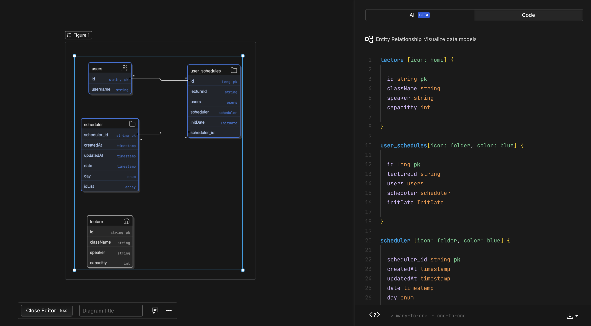

## 요구사항

### step3
- 설계한 테이블에 대한 **ERD** 및 이유를 설명하는 **README** 작성
- 선착순 30명 이후의 신청자의 경우 실패하도록 개선
- 동시에 동일한 특강에 대해 40명이 신청했을 때, 30명만 성공하는 것을 검증하는 **통합 테스트** 작성
### step4
- 같은 사용자가 동일한 특강에 대해 신청 성공하지 못하도록 개선
- 동일한 유저 정보로 같은 특강을 5번 신청했을 때, 1번만 성공하는 것을 검증하는 **통합 테스트** 작성

## 모델링

*** user와 특강목록은 다대다 관계로 정의하였습니다. ***

- user가 특강 여러개를 수강할 수 있고 , 하나의 특강은 여러 user로 구성되기에 userScheduler 라는 중간 클래스를 만들어서 relation을 풀어내고자 하였습니다.
- schedule엔티티는는 특강을 정의한 객체로  수강 제한 인원 capacity 의 인원이 0 이 되면 deadline 컬럼 flag 값이 바뀌는 식으로 구현하였습니다.

## trouble 
- 동시성 이슈 
 비관적 lock을 활용하여 동시성 문제를 해결하고자 하였습니다.
 비관적 lock은 다수의 트랜잭션이 동일한 자원을 바라볼 때 발생하는 충돌을 예방하기위해 lock을 걸고 다른 트랜잭션의 접근을 제한하는 방법입니다.
 위 동작원리를 근거로 비지니스 로직 윗단에서 조회 쿼리에 비관적 락을 걸어놓으면 해당 lock 을 획득해야 이후 기능절차가 진행된다는 접근이었습니다.

but 
 하지만 코드간의 느슨한 결합을 위해 이벤트를 활용한 것이 문제였는지 dead lock 이 발생하였습니다.  
 해당 건을 해결하기위해 I/O하는 모든 구간에 lock을 걸어서 순차적으로 동작하게 만들어 dead lock을 해결하였지만, 
 문제를 해결하기위해 또다른 문제를 만든 것 같아서 고민입니다.

- test container
test case를 작성하고 요구사항에 있는 통합test를 local에서 작성하여 검증하였으나, 
testDB 설정이 미숙하여 똑같은 환경에서 test 가능하도록 코드를 공유하지 못하였습니다..

## 기술 적용점. 

- 비관적 락
- @TransactionalListener
- 패키지 구조 
application: 도메인이나 service 같은 core 한 영역을 구성한다 
controller,repository : 다른 계층으로 전달하거나 받는 외부영역과 가까운 계층이다(persistence, web). 

